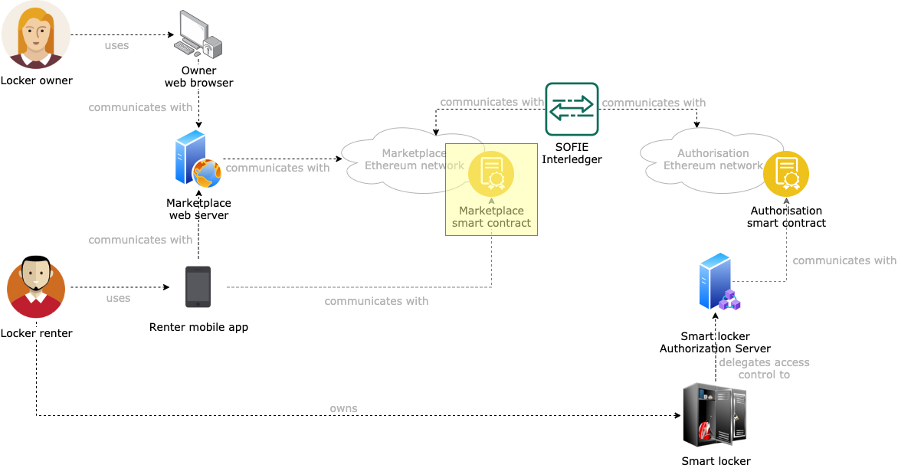

# SMAUG Marketplace Smart Contract

This components extends the functionalities of the [SOFIE Marketplace (MP) smart contract](https://github.com/SOFIE-project/Marketplace/tree/master/solidity). The goal of this component is to implement a decentralized, Ethereum-based marketplace that allows for two types of interactions:

1. *auction-style*, where several interested renters compete with each other to present the best offer for the smart locker owner
2. *instant-rent* , where any interested renter can instantly ensure access to a smart locker for the time specified if the offer fulfills the requirements set by the smart locker owner at request creation time

## Architecture

A representation of where this component fits in the SMAUG architecture is presented below.


## Smart contract API

The SMAUG Marketplace Smart Contract implements several intefaces from the SOFIE [Marketplace](https://github.com/SOFIE-project/Marketplace) and [Interledger](https://github.com/SOFIE-project/Interledger) components. Specifically:

The `ArrayRequestExtraData` and `ArrayOfferExtraData` interfaces from the [SOFIE Marketplace (MP) smart contract](https://github.com/SOFIE-project/Marketplace/tree/master/solidity), to support submission of request and offer extras in the form of `uint[]`:

```javascript
interface ArrayOfferExtraData {
    function submitOfferArrayExtra(uint offerID, uint[] calldata extra) external payable returns (uint8 status, uint offID);
}

interface ArrayRequestExtraData {
    function submitRequestArrayExtra(uint requestID, uint[] calldata extra) external returns (uint8 status, uint reqID);
}
```

The `InterledgerSenderInterface` and `InterledgerReceiverInterfaces` from the [SOFIE Interledger (IL) component](https://github.com/SOFIE-project/Interledger), to support the triggering and receiving of Interledger payloads:

```javascript
contract InterledgerSenderInterface {
    event InterledgerEventSending(uint256 id, bytes data);
    function interledgerCommit(uint256 id) public;
    function interledgerCommit(uint256 id, bytes memory data) public;
    function interledgerAbort(uint256 id, uint256 reason) public;
}

contract InterledgerReceiverInterface {
    event InterledgerEventAccepted(uint256 nonce);
    event InterledgerEventRejected(uint256 nonce);
    function interledgerReceive(uint256 nonce, bytes memory data) public;
}
```

Furthermore, the SMAUG Marketplace supports all the functionalities of the [SOFIE Marketplace (MP) smart contract](https://github.com/SOFIE-project/Marketplace/tree/master/solidity), exposing the following APIs:

```javascript
event RequestAdded(uint requestID, uint deadline);
event RequestExtraAdded(uint requestID);
event OfferAdded(uint offerID, uint requestID, address offerMaker);
event OfferExtraAdded(uint offerID);
event TradeSettled(uint requestID, uint offerID);

// The following events are specific for the SMAUG smart contract. They are not part of the SOFIE Marketplace smart contracts.
event OfferClaimable(uint indexed offerID);     // When an access token is issued for the offer offerID, this event is generated to allow the offer creator to retrieve the generated access token to be used to use the smart locker.
event OfferFulfilled(uint indexed offerID, bytes token);    // When an offer is not selected for an auction, this event is generated to allow the offer creator to claim back the money that was escrowed upon offer submission.
event RequestClaimable(uint indexed requestID, uint[] offerIDs);    // When all the access tokens are issued for the request requestID, this event is generated to allow the request creator to claim the Ethers escrowed by the all the offer creators as compensation for granting access to the smart locker for the requested amount of time.
event PaymentCashedOut(uint indexed requestID, uint indexed offerID, uint amount);      // When either the request creator or a losing offer creator claim the Ethers escrowed in an offer, this event is generated.

function getMarketInformation() public view returns (uint8 status, address ownerAddress);
function submitRequest(uint deadline) public returns (uint8 status, uint requestID);
function closeRequest(uint requestIdentifier) public returns (uint8 status);
function decideRequest(uint requestIdentifier, uint[] memory acceptedOfferIDs) public returns(uint8 status);
function deleteRequest(uint requestIdentifier) public returns (uint8 status);
function submitOffer(uint requestID) public returns (uint8 status, uint offerID);
function getOpenRequestIdentifiers() external view returns (uint8 status, uint[] memory);
function getClosedRequestIdentifiers() external view returns (uint8 status, uint[] memory);
function getRequest(uint requestIdentifier) external view returns (uint8 status, uint deadline, uint stage, address requestMaker);
function getRequestOfferIDs(uint requestIdentifier) external view returns (uint8 status, uint[] memory offerIDs);
function isOfferDefined(uint offerIdentifier) public view returns (uint8 status, bool);
function getOffer(uint offerIdentifier) external view returns (uint8 status, uint requestID, address offerMaker, uint stage);
function isRequestDefined(uint requestIdentifier) public view returns (uint8 status, bool);
function isRequestDecided(uint requestIdentifier) public view returns (uint8 status, bool);
function settleTrade(uint requestID, uint offerID) public returns (uint8 status);
function getRequestDecisionTime(uint requestIdentifier) public view returns (uint8 status, uint);
function getRequestDecision(uint requestIdentifier) public view returns (uint8 status, uint[] memory acceptedOfferIDs);
```

Additionally to these functionalities, SMAUG marketplace supports access control for request creation, by requiring request creators to present a valid access token upon request creation. An access token is considered valid if it has been signed by a manager of the marketplace, has been issued to the account creating the request (to prevent token borrowing), has an audience address which matches the address of the marketplace smart contract (that binds the access token to a specific smart contract), and its nonce has not already been used (to prevent double-spending). The APIs that support this functionalities are:

```javascript
function resetAccessTokens() public returns (uint8 status);     // Reset the storage for access tokens. All previously used access tokens can now be re-used. Can only be called by one of the smart contract managers
function submitAuthorisedRequest(bytes32 tokenDigest, bytes memory signature, bytes32 nonce, uint deadline) public returns (uint8 status, uint requestID);      // Performs the same action as the submitRequest() function, with the addition that it expects a valid access token that matches the requirements explained above.

```

## Deployment

### Fresh start

When the project is cloned for the first time, run `npm install`. This will install all the needed `npm` dependencies, as well as generate all the [Typechain](https://github.com/ethereum-ts/TypeChain) typescript bindings needed for development.

## Compile the smart contracts

From the root of the project, run `npm run build` to compile the smart contracts and their typescript typings.

## Migrate the smart contracts

Migration represents the process of deploying the smart contracts on a target blockchain.

### Spin up a local blockchain with a shared state

Migrations are run either as a standalone operation, in case a smart contract needs to be deployed on a target blockchain, or as the first step in the testing procedure. In doing so, Truffle spins up a local ganache instance which is then teared down at the end of the tests.

In our case, to make easier and faster to set up the development environment, some scripts are provided to spin up a blockchain locally on the machine on port 8545 using the [Truffle ganache-cli](https://hub.docker.com/r/trufflesuite/ganache-cli/) Docker image. To do so, run `npm run deploy:marketplace`. The Docker container uses a mounted volume for the blockchain database, meaning that restarting the container will preserve the state of the blockchain (all the contracts deployed and all the transactions issued). The state of the blockchain is saved in the `marketplace_state`, **so it is highly discouraged to touch the content of this directory, since that would invalidate the whole blockchain state**.

> In case the port that the script uses to configure the local blockchain is used, the port information needs to be changed in the following files: `truffle-config.js` (for the `marketplace` network), `scripts/lunch_marketplace_blockchain` (the `HOST_PORT` variable must be changed). Make sure the port numbers match in the two files.

### Run a migration

Assuming the blockchain development provided in this repository is used, then a migration can be performed by running `npm run migrate:marketplace`.

If another blockchain network is to be used, then the command to execute will also need to include the name of that blockchain: `npm run migrate -- --network <NETWORK_NAME>`.

## Test the smart contracts

Run `npm run test` if tests must be run on the development blockchain started by Truffle, otherwise `npm run test:marketplace` to run the tests on the local development blockchain. Ignore any typescript-related errors that might be generated on the console.

If another blockchain network is to be used, then the command to execute will also need to include the name of that blockchain: `npm run test -- --network <NETWORK_NAME>`.